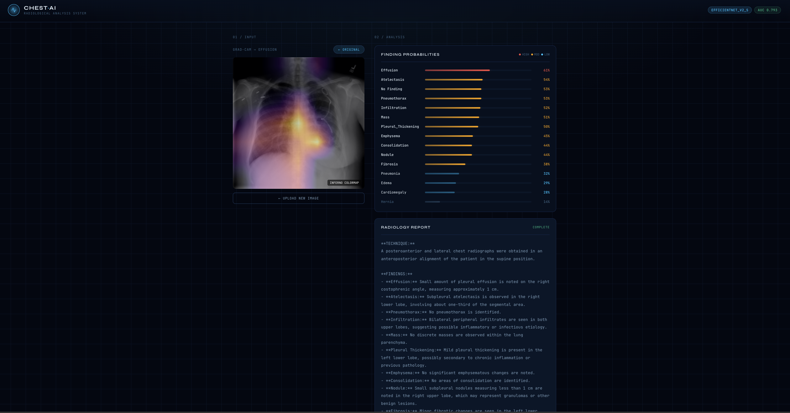
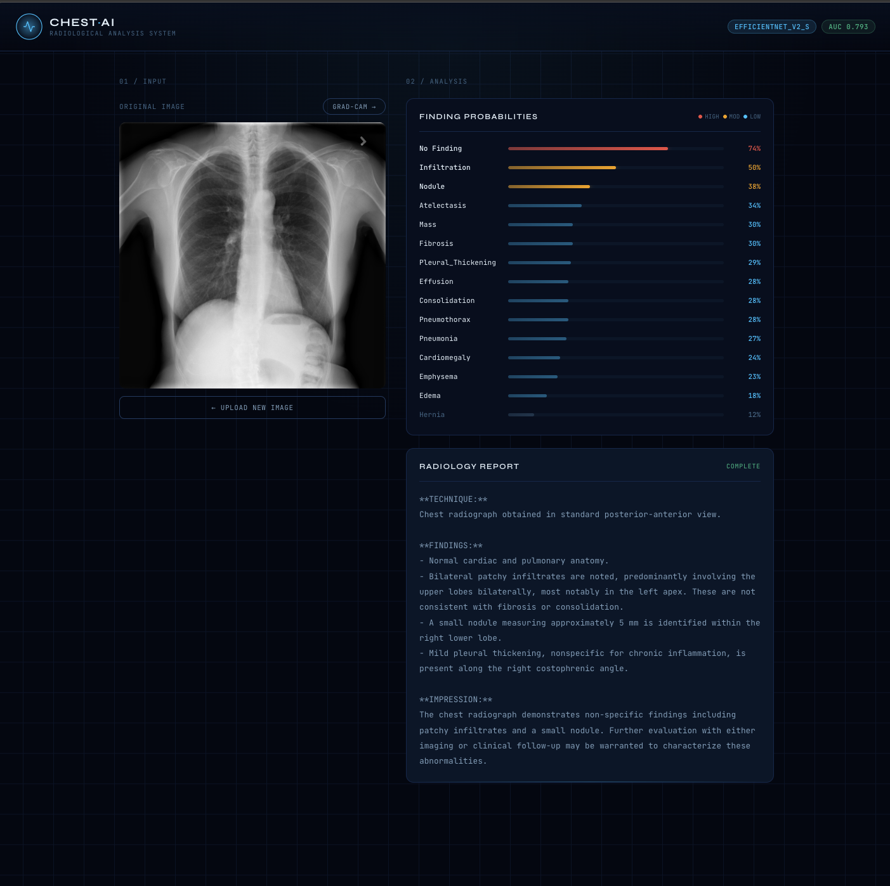

# Chest X-Ray AI — Multi-Label Pathology Classification

> 4-model ensemble (EfficientNetV2-S + rad-dino + Swin-Base + ConvNeXt-Base 320px) trained on NIH ChestX-ray14 with a FastAPI + React inference demo, Grad-CAM visualizations, and AI-generated radiology reports via local LLM.




---

## Results

Trained on the full NIH ChestX-ray14 dataset (112,120 images, 30,805 patients) using the official train/test split. Evaluated on the held-out test set of 25,596 images with Test-Time Augmentation (TTA, 7 passes).

| Class | AUC-ROC | AUC-PR | F1 | Prevalence |
|---|---|---|---|---|
| No Finding | 0.742 | 0.673 | 0.615 | 38.5% |
| Atelectasis | 0.783 | 0.372 | 0.411 | 12.8% |
| Cardiomegaly | 0.893 | 0.367 | 0.421 | 4.2% |
| Effusion | 0.840 | 0.540 | 0.550 | 18.2% |
| Infiltration | 0.713 | 0.407 | 0.494 | 23.9% |
| Mass | 0.828 | 0.335 | 0.386 | 6.8% |
| Nodule | 0.765 | 0.233 | 0.300 | 6.3% |
| Pneumonia | 0.731 | 0.053 | 0.099 | 2.2% |
| Pneumothorax | 0.882 | 0.446 | 0.504 | 10.4% |
| Consolidation | 0.756 | 0.161 | 0.259 | 7.1% |
| Edema | 0.856 | 0.180 | 0.257 | 3.6% |
| Emphysema | 0.911 | 0.380 | 0.431 | 4.3% |
| Fibrosis | 0.837 | 0.112 | 0.186 | 1.7% |
| Pleural Thickening | 0.777 | 0.146 | 0.215 | 4.5% |
| Hernia | 0.903 | 0.259 | 0.340 | 0.3% |
| **Mean** | **0.815** | **0.311** | **0.365** | — |

**CheXNet (DenseNet-121) baseline: ~0.745 mean AUC** — Rajpurkar et al., arXiv 2017.

### Improvement Progression

| Model | Test AUC |
|---|---|
| EfficientNetV2-S | 0.759 |
| EfficientNetV2-S + TTA | 0.765 |
| ConvNeXt-Base (60 epochs) + TTA | 0.770 |
| Ensemble (EfficientNetV2-S + ConvNeXt-Base) + TTA | 0.793 |
| **4-Model Ensemble + TTA** | **0.815** |

---

## Architecture

### Model 1 — EfficientNetV2-S

```
Input (224×224 RGB)
       │
       ▼
EfficientNetV2-S backbone         ← ImageNet-21k pretrained (timm)
  tf_efficientnetv2_s.in21k_ft_in1k
  20.2M parameters
       │
       ▼
Global Average Pool → [1280]
       │
       ▼
Classification Head
  LayerNorm(1280) → Dropout(0.3) → Linear(1280→512) → GELU → Dropout(0.15) → Linear(512→15)
       │
       ▼
15-class multi-hot output (sigmoid)
```

### Model 2 — rad-dino

```
Input (224×224 RGB)
       │
       ▼
ViT-B/14 backbone                 ← Pretrained on chest X-rays via DINO (Microsoft)
  microsoft/rad-dino
  ~86M parameters
       │
       ▼
CLS token → [768]
       │
       ▼
Classification Head
  LayerNorm(768) → Dropout(0.3) → Linear(768→512) → GELU → Dropout(0.15) → Linear(512→15)
       │
       ▼
15-class multi-hot output (sigmoid)
```

### Model 3 — Swin-Base

```
Input (224×224 RGB)
       │
       ▼
Swin-Base backbone                ← ImageNet-22k pretrained (timm)
  swin_base_patch4_window7_224.ms_in22k_ft_in1k
  88M parameters
       │
       ▼
Global Average Pool → [1024]
       │
       ▼
Classification Head
  LayerNorm(1024) → Dropout(0.3) → Linear(1024→512) → GELU → Dropout(0.15) → Linear(512→15)
       │
       ▼
15-class multi-hot output (sigmoid)
```

### Model 4 — ConvNeXt-Base 320px

```
Input (320×320 RGB)
       │
       ▼
ConvNeXt-Base backbone            ← Fine-tuned from 224px checkpoint
  convnext_base.fb_in22k_ft_in1k
  88.1M parameters
       │
       ▼
Global Average Pool → [1024]
       │
       ▼
Classification Head
  LayerNorm(1024) → Dropout(0.3) → Linear(1024→512) → GELU → Dropout(0.15) → Linear(512→15)
       │
       ▼
15-class multi-hot output (sigmoid)
```

### Ensemble

Predictions from all 4 models are run with TTA (7 passes each) and averaged in probability space before threshold optimization. GradCAM visualization uses EfficientNetV2-S (fastest Conv backbone).

### Training Recipe

| Phase | Epochs | Backbone | Head LR | Backbone LR |
|---|---|---|---|---|
| 1 — Transfer learning | 1–N | Frozen | 1e-3 | — |
| 2 — Fine-tuning | N+1–end | Unfrozen | 1e-4 | 1e-5 |

| Setting | EfficientNetV2-S | rad-dino | Swin-Base | ConvNeXt-Base 320px |
|---|---|---|---|---|
| Total epochs | 30 | 40 | 60 | 30 |
| Best epoch | 28 | 40 | 60 | 29 |
| Val AUC | 0.786 | 0.832 | 0.816 | 0.834 |
| Resolution | 224px | 224px | 224px | 320px |
| drop_path_rate | 0.2 | — | 0.4 | 0.3 |

- **Loss**: Asymmetric Loss (γ⁻=4.0, γ⁺=1.0) + label smoothing 0.05
- **Optimizer**: AdamW (weight decay 1e-2, effective batch 240–256 via gradient accumulation)
- **Scheduler**: Cosine annealing with 3-epoch linear warmup + SWA in final epochs
- **Augmentation**: MixUp (α=0.3–0.4) + standard geometric augmentations
- **AMP**: Mixed precision (float16 on CUDA)
- **Hardware**: RTX 5070 Ti (17GB VRAM)

### Key Engineering Decisions

**Official patient-level split** — Uses NIH's `train_val_list.txt` and `test_list.txt` with a binary patient-hash inner split (82/18) to prevent data leakage. Avoids the common mistake of random image splits where the same patient appears in train and test.

**No Finding exclusivity** — The NIH labels are NLP-mined and contain ~2% noisy co-occurrences of "No Finding" with pathologies. Enforcing mutual exclusivity at label encoding fixed No Finding AUC from 0.492 → 0.742.

**Medical-domain pretraining** — rad-dino (ViT-B/14 pretrained on chest X-rays via DINO) achieved the highest individual val AUC (0.832) and notably improved Pneumonia AUC (0.717 → 0.731), the hardest class.

**Anti-shortcut augmentations** — `AutoCropNonBlack` removes scanner borders, `CornerMask` randomly blacks out corners to prevent the model from learning burned-in text/markers.

**Asymmetric Loss + label smoothing** — ASL handles positives and negatives with separate gamma values. Label smoothing (0.05) adds soft-target robustness against NIH's ~10% label noise.

**MixUp regularization** — Blends pairs of training samples with beta-distributed mixing coefficients, further reducing overfitting to noisy labels.

**No horizontal flip in TTA** — Chest X-rays have clinically significant laterality (cardiac apex, gastric bubble, effusion side, pneumothorax laterality). Horizontal flip TTA corrupts these features and hurts performance.

**Stochastic Weight Averaging (SWA)** — Averages model weights from the final training epochs to find flatter minima. Saved as `_swa.pt` variants alongside the best checkpoint.

**320px fine-tuning** — ConvNeXt-Base warm-started from the 224px checkpoint and fine-tuned at 320px (batch 32, accumulation ×8). Highest individual val AUC (0.834).

**Temperature scaling** — Post-hoc calibration via scalar temperature T fitted on the validation set.

---

## Demo

A full-stack inference demo with:
- Real-time pathology probability bars with severity color coding
- Grad-CAM heatmap for the top predicted finding (INFERNO colormap)
- AI-generated structured radiology report via local LLM (Ollama)

### Stack

| Layer | Technology |
|---|---|
| ML inference + Grad-CAM | PyTorch, timm, transformers |
| API | FastAPI + Uvicorn |
| Report generation | Ollama (qwen2.5:latest) |
| Frontend | React 18 + Framer Motion |
| Build tool | Vite |

---

## Setup

### Requirements

- Python 3.10+
- Node.js 18+
- [Ollama](https://ollama.ai) with `qwen2.5:latest` pulled

### 1. Clone and install Python dependencies

```bash
git clone https://github.com/EltonGino/EltonGino-chest-xray-ai.git
cd EltonGino-chest-xray-ai

python -m venv .venv
source .venv/bin/activate  # Windows: .venv\Scripts\activate

pip install -r requirements.txt
```

> **CUDA (Windows/Linux):** Install PyTorch with CUDA first:
> ```bash
> pip install torch torchvision --index-url https://download.pytorch.org/whl/cu128
> pip install -r requirements.txt
> ```

### 2. Download the dataset

Download the NIH ChestX-ray14 dataset from [Kaggle](https://www.kaggle.com/datasets/nih-chest-xrays/data) and place it as:

```
data/NIH_chest_x-ray/
├── Data_Entry_2017.csv
├── train_val_list.txt
├── test_list.txt
└── images/
    ├── 00000001_000.png
    └── ...
```

Update the `data:` paths in `configs/config.yaml` to match your local setup.

### 3. Train

```bash
# EfficientNetV2-S
python -m src.train --config configs/config.yaml

# rad-dino (medical pretrained ViT)
python -m src.train --config configs/config_rad_dino.yaml

# Swin-Base
python -m src.train --config configs/config_swin_base.yaml

# ConvNeXt-Base 320px (fine-tune from 224px checkpoint)
python -m src.train --config configs/config_convnext_320.yaml
```

### 4. Evaluate

```bash
# 4-model ensemble with TTA
python -m src.evaluate \
  --ensemble \
    checkpoints/best_model_efficientnet_v2_s.pt \
    checkpoints/best_model_rad_dino.pt \
    checkpoints/best_model_swin_base.pt \
    checkpoints/best_model_convnext_base.pt \
  --save-dir outputs/eval_ensemble \
  --tta-passes 6 \
  --csv-path "data/NIH_chest_x-ray/Data_Entry_2017.csv" \
  --image-dir "data/NIH_chest_x-ray/images" \
  --train-val-list "data/NIH_chest_x-ray/train_val_list.txt" \
  --test-list "data/NIH_chest_x-ray/test_list.txt"
```

### 5. Run with Docker (recommended)

```bash
# Pull the qwen2.5 model into the ollama container (first time only)
docker compose run --rm ollama ollama pull qwen2.5

# Start API + Ollama
docker compose up --build
```

API available at `http://localhost:8000`, health check at `http://localhost:8000/health`.

The checkpoint is mounted from `./checkpoints/` — it is never baked into the image.

### 6. Run the inference demo (without Docker)

**Terminal 1 — Backend:**
```bash
ollama pull qwen2.5        # first time only
source .venv/bin/activate
python api.py
```

**Terminal 2 — Frontend:**
```bash
cd frontend
npm install
npm run dev
```

Open [http://localhost:5173](http://localhost:5173)

---

## Project Structure

```
nih-chest-xray/
├── src/
│   ├── dataset.py       # NIHChestXrayLocal, transforms, split logic
│   ├── models.py        # ChestXrayClassifier, AsymmetricLoss, FocalLoss, _RadDinoWrapper
│   ├── train.py         # Training loop, AMP, MixUp, SWA, early stopping, checkpointing
│   └── evaluate.py      # Per-class metrics, Grad-CAM, TTA, ensemble, calibration
├── configs/
│   ├── config.yaml                # EfficientNetV2-S config
│   ├── config_rad_dino.yaml       # rad-dino (medical pretrained ViT)
│   ├── config_swin_base.yaml      # Swin-Base config
│   └── config_convnext_320.yaml   # ConvNeXt-Base 320px fine-tune
├── frontend/
│   ├── src/App.jsx      # React inference demo
│   ├── index.html
│   ├── package.json
│   └── vite.config.js
├── tests/
│   └── test_dataset.py  # 29 unit tests for dataset logic
├── .github/
│   └── workflows/
│       └── tests.yml    # CI — runs pytest on every push
├── api.py               # FastAPI inference server (4-model ensemble)
├── Dockerfile           # CPU image for deployment
├── docker-compose.yml   # API + Ollama services
├── checkpoints/         # Saved model weights
└── outputs/             # Evaluation plots and figures
```

---

## Limitations

- **Label noise**: NIH labels are NLP-mined from radiology reports with ~10% estimated noise. Per-class performance reflects label quality as much as model quality.
- **Weak classes**: Pneumonia (0.731) and Infiltration (0.713) are the hardest classes — both are diagnostically ambiguous and have the noisiest labels in CXR14.
- **Not for clinical use**: This is a research/portfolio project. Predictions should not be used for medical diagnosis.
- **Dataset shift**: Performance may degrade on images from scanners or acquisition protocols significantly different from the NIH dataset.

---

## References

- Wang et al., *ChestX-ray8: Hospital-scale Chest X-ray Database and Benchmarks*, CVPR 2017
- Rajpurkar et al., *CheXNet: Radiologist-Level Pneumonia Detection on Chest X-Rays with Deep Learning*, arXiv 2017
- Ben-Baruch et al., *Asymmetric Loss For Multi-Label Classification*, ICCV 2021
- Tan & Le, *EfficientNetV2: Smaller Models and Faster Training*, ICML 2021
- Liu et al., *A ConvNet for the 2020s*, CVPR 2022
- Zhou et al., *iBot: Image BERT Pre-Training with Online Tokenizer*, ICLR 2022
- Pérez-García et al., *RAD-DINO: Exploring Scalable Medical Image Encoders Beyond Text Supervision*, arXiv 2024

---

## Author

**Elton Gino Santos** — AI Engineer & Computer Vision Specialist

[](https://linkedin.com/in/elton-gino)
[](https://github.com/EltonGino)

---

*Dataset: NIH Clinical Center, public domain with attribution. Code: MIT License.*
